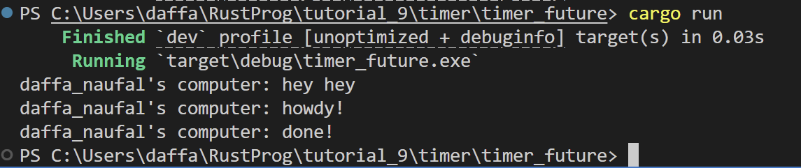

__1.2 Understanding how it works__

Berdasarkan hasil outputnya, fungsi async akan dieksekusi di luar fungsi utama yang memanggilnya. Sebagai hasilnya, kemungkinan output " ... hey hey" akan muncul sebelum ".. howdy!" dan "... done!" karena kode "... hey hey" berada di luar fungsi async. 

Ini terjadi karena program tidak menunggu pesan yang berada di fungsi async untuk selesai dieksekusi, maka dari itu program mencetak "hey hey" terlebih dahulu sedangkan fungsi async masih menunggu hasil dari future timer.