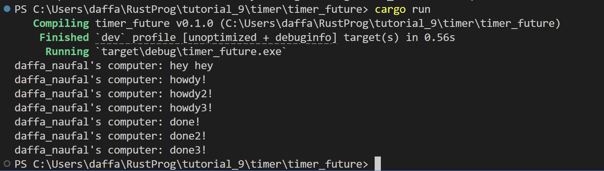
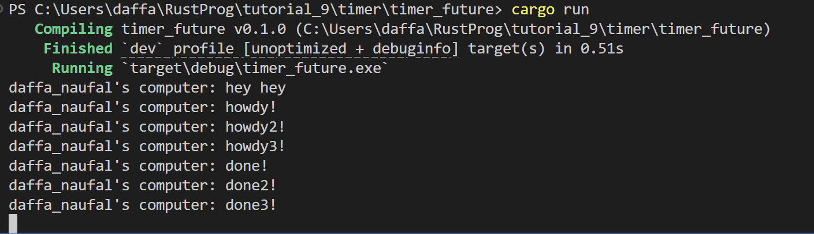

__1.2 Understanding how it works__

Berdasarkan hasil outputnya, fungsi async akan dieksekusi di luar fungsi utama yang memanggilnya. Sebagai hasilnya, kemungkinan output " ... hey hey" akan muncul sebelum ".. howdy!" dan "... done!" karena kode "... hey hey" berada di luar fungsi async. 

Ini terjadi karena program tidak menunggu pesan yang berada di fungsi async untuk selesai dieksekusi, maka dari itu program mencetak "hey hey" terlebih dahulu sedangkan fungsi async masih menunggu hasil dari future timer.

__1.3: Multiple Spawn and removing drop__

Dari hasil output dengan multiple spawn, terlihat bahwa cara kerjanya seperti urutan fungsi async mana yang dipanggil duluan, lalu menunggu. Namun, bisa saja spawn ketiga 'done!' terlebih dahulu baru spawn kedua. Selain itu, pesan 'hey hey' masih dieksekusi duluan karena bukan berada dalam async.

Berbeda ketika kita meng-drop spawner, setelah pesan tereksekusi semua, program masih berjalan, seperti masih menunggu pesan lain dan tidak tahu kapan executor harusnya berhenti. Ketika suatu spawner memanggil fungsi spawn, tercipta tugas baru yang dialirkan ke pengirim tugas. Executor akan mengambil satu tugas dari pengirim tugas, menjalankannya, dan setelah itu mengambil tugas berikutnya hingga selesai dan fungsi drop spawner disini bertugas sebagai penanda bahwa executor sudah bisa berhenti.